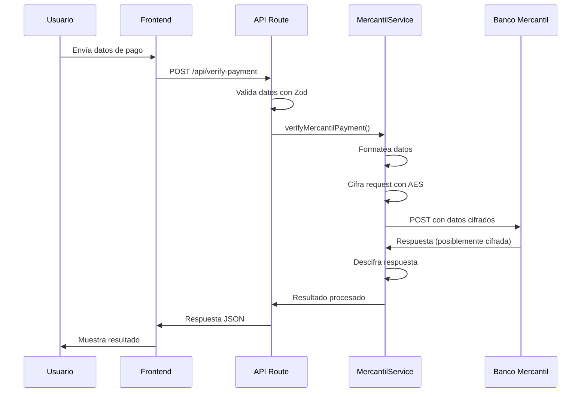

# Integración con API de Mercantil Banco

Este documento describe la integración implementada con la API de búsqueda de pagos móviles (C2P) del Banco Mercantil.

## Configuración

### Variables de Entorno

Para usar la API de Mercantil, configure las siguientes variables en su archivo `.env.local`:

```bash
# Ambiente de certificación (recomendado para pruebas)
MERCANTIL_CERT_CLIENT_ID=your_cert_client_id_here
MERCANTIL_CERT_MERCHANT_ID=your_cert_merchant_id_here
MERCANTIL_CERT_SECRET_KEY=your_cert_secret_key_here
MERCANTIL_CERT_ENDPOINT=https://apimbu.mercantilbanco.com/mercantil-banco/cert/v1/payment/search

# Ambiente de producción
MERCANTIL_SEARCH_CLIENT_ID=your_mercantil_client_id_here
MERCANTIL_SEARCH_MERCHANT_ID=your_merchant_id_here
MERCANTIL_SEARCH_SECRET_KEY=your_secret_key_here
MERCANTIL_SEARCH_ENDPOINT=https://apimbu.mercantilbanco.com/mercantil-banco/prod/v1/payment/search

# Configuración de ambiente (cert/prod)
MERCANTIL_ENVIRONMENT=cert
```

### Obtención de Credenciales

Para obtener las credenciales necesarias:

1. **Ser cliente de Mercantil Banco**
2. **Estar afiliado a Mercantil en Línea Empresas**
3. **Tener una aplicación empresarial o sitio web**
4. **Contactar al equipo de APIs de Mercantil** para solicitar acceso

## Arquitectura de la Integración

### Componentes Implementados

1. **`lib/mercantil-crypto.ts`** - Utilidades de cifrado AES/ECB/PKCS5Padding
2. **`lib/mercantil-service.ts`** - Servicio principal para interactuar con la API
3. **`lib/mercantil-errors.ts`** - Manejo de errores específicos de Mercantil
4. **`app/api/verify-payment/route.ts`** - Endpoint actualizado con integración

### Flujo de Verificación



## Características Implementadas

### Seguridad

- **Cifrado AES/ECB/PKCS5Padding** según especificaciones de Mercantil
- **Clave secreta hasheada con SHA-256**
- **Headers de autenticación** con X-IBM-Client-Id
- **Validación de credenciales** antes de cada operación

### Manejo de Errores

- **Códigos de error específicos** de Mercantil
- **Reintentos automáticos** para errores recuperables
- **Timeouts configurables** (30 segundos por defecto)
- **Logging estructurado** para monitoreo

### Validaciones

- **Números de teléfono venezolanos** (formato 04XX-XXXXXXX)
- **Referencias de pago** (formato y longitud)
- **Montos** (números positivos)
- **Fechas** (formato ISO YYYY-MM-DD)

## Uso de la API

### Desde el Frontend

Cuando el usuario selecciona "Banco Mercantil" en el formulario, la aplicación:

1. Valida automáticamente el formato del teléfono
2. Envía la solicitud al endpoint `/api/verify-payment`
3. Usa la API real de Mercantil en lugar de simulación
4. Muestra resultados en tiempo real

### Criterios de Búsqueda Soportados

- **Número de referencia** (recomendado)
- **Monto del pago**
- **Número de teléfono móvil**
- **Rango de fechas**

### Ejemplo de Request

```json
{
  "bank": "Mercantil",
  "reference": "REF123456789",
  "amount": 150.50,
  "phone": "0412-1234567",
  "date": "2024-01-15"
}
```

### Ejemplo de Response Exitosa

```json
{
  "success": true,
  "status": "verified",
  "message": "Pago verificado exitosamente con Mercantil Banco",
  "details": {
    "reference": "REF123456789",
    "amount": 150.50,
    "bank": "Banco Mercantil",
    "phone": "0412-1234567",
    "date": "2024-01-15T10:30:00Z",
    "verificationId": "MER-1705312200000",
    "timestamp": "2024-01-15T10:30:00.000Z",
    "bankId": "0105",
    "currency": "VES",
    "transactionStatus": "completed"
  }
}
```

### Ejemplo de Response de Error

```json
{
  "success": false,
  "status": "error",
  "message": "No se encontró ningún pago con los criterios especificados.",
  "details": {
    "errorCode": "SEARCH_001",
    "timestamp": "2024-01-15T10:30:00.000Z",
    "severity": "low",
    "retryable": false,
    "searchCriteria": {
      "reference": "REF123456789",
      "amount": 150.50,
      "phone": "0412-1234567"
    }
  }
}
```

## Códigos de Error

### Autenticación
- `AUTH_001` - Client ID inválido
- `AUTH_002` - Clave secreta inválida
- `AUTH_003` - Token expirado

### Validación
- `VAL_001` - Número de teléfono inválido
- `VAL_002` - Referencia de pago inválida
- `VAL_003` - Monto inválido
- `VAL_004` - Fecha inválida

### Búsqueda
- `SEARCH_001` - Pago no encontrado
- `SEARCH_002` - Múltiples pagos encontrados
- `SEARCH_003` - Criterios de búsqueda insuficientes

### Red y Sistema
- `NET_001` - Timeout de conexión
- `NET_002` - Error de conexión
- `SYS_001` - Servicio temporalmente no disponible
- `SYS_002` - Error interno del servidor

### Cifrado
- `CRYPTO_001` - Error de cifrado
- `CRYPTO_002` - Error de descifrado

## Pruebas

### Ambiente de Certificación

Para probar la integración:

1. Configure las variables de entorno de certificación
2. Use `MERCANTIL_ENVIRONMENT=cert`
3. Realice pruebas con datos de prueba proporcionados por Mercantil

### Datos de Prueba Sugeridos

```bash
# Teléfonos de prueba
0412-0000001  # Pago exitoso
0412-0000002  # Pago no encontrado
0412-0000003  # Error de sistema

# Referencias de prueba
TEST-SUCCESS-001  # Pago exitoso
TEST-NOTFOUND-001 # Pago no encontrado
TEST-ERROR-001    # Error de sistema
```

## Monitoreo y Logging

### Logs Estructurados

Todos los errores se registran con:
- Timestamp
- Código de error
- Mensaje técnico
- Contexto de la operación
- Criterios de búsqueda

### Métricas Recomendadas

- Tiempo de respuesta de la API
- Tasa de éxito/error por tipo
- Volumen de transacciones por hora
- Errores de autenticación

## Consideraciones de Producción

### Seguridad

1. **Nunca exponer** las claves secretas en el frontend
2. **Usar HTTPS** en todas las comunicaciones
3. **Implementar rate limiting** para prevenir abuso
4. **Monitorear** intentos de acceso no autorizados

### Performance

1. **Implementar caché** para consultas frecuentes
2. **Usar connection pooling** para requests HTTP
3. **Configurar timeouts** apropiados
4. **Implementar circuit breakers** para fallos en cascada

### Escalabilidad

1. **Usar variables de entorno** para configuración
2. **Implementar health checks** para la API
3. **Configurar alertas** para errores críticos
4. **Documentar** todos los endpoints y códigos de error

## Soporte

Para soporte técnico:

1. **Documentación oficial**: [API Mercantil GitHub](https://github.com/apimercantil)
2. **Postman Collection**: Disponible en el repositorio oficial
3. **Ejemplos de código**: En el repositorio `api-playground`
4. **Contacto técnico**: A través del portal de desarrolladores de Mercantil

## Changelog

### v1.0.0 (2024-01-15)
- Implementación inicial de la integración
- Soporte para búsqueda de pagos móviles
- Manejo de errores específicos
- Validaciones de datos venezolanos
- Cifrado AES según especificaciones
- Reintentos automáticos
- Logging estructurado